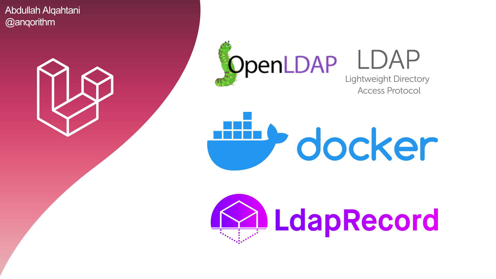

# Implementing LDAP Authentication Integration in Laravel: A Guide to Using OpenLDAP, PHPLdapAdmin, and Docker with the LdapRecord Package

This guide walks you through the process of implementing LDAP authentication integration in a Laravel application using OpenLDAP, phpLDAPadmin, and Docker, along with the LdapRecord package. By following the steps outlined in this guide, you'll learn how to set up an OpenLDAP server, configure phpLDAPadmin for easy LDAP management, and integrate LDAP authentication into your Laravel application eaisly.

